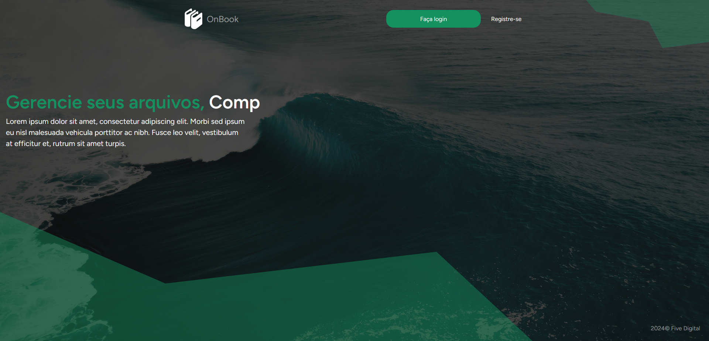

# TESTE - Five Digital


### Passo a passo para rodar o projeto 

Crie o Arquivo .env
```sh
cp .env.example .env
```

Atualize as variáveis de ambiente do arquivo .env
```dosini
APP_NAME="Especializa Ti"
APP_URL=http://localhost:8989

DB_CONNECTION=mysql
DB_HOST=db
DB_PORT=3306
DB_DATABASE=laravel
DB_USERNAME=userpass
DB_PASSWORD=username

CACHE_DRIVER=redis
QUEUE_CONNECTION=redis
SESSION_DRIVER=redis

REDIS_HOST=redis
REDIS_PASSWORD=null
REDIS_PORT=6379
```

Para a conexão com o AWS BUCKET - S3 !OBRIGATORIO
```dosini
AWS_ACCESS_KEY_ID=
AWS_SECRET_ACCESS_KEY=
AWS_DEFAULT_REGION=
AWS_BUCKET=
```
Suba os containers do projeto
```sh
docker-compose up -d
```


Acessar o container
```sh
docker-compose exec app bash
```


Instalar as dependências do projeto
```sh
composer install
```


Gerar a key do projeto Laravel
```sh
php artisan key:generate
```

Acessar o projeto
[http://localhost:8000](http://localhost:8000)

# Previews 


